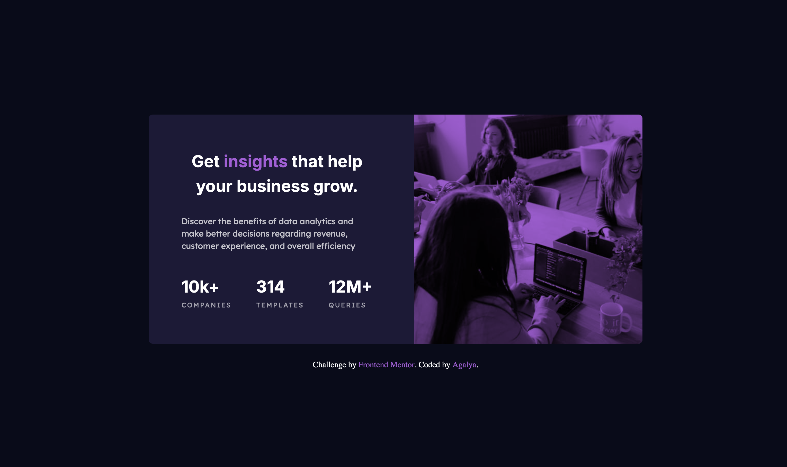

# Frontend Mentor - Stats preview card component solution

This is a solution to the [Stats preview card component challenge on Frontend Mentor](https://www.frontendmentor.io/challenges/stats-preview-card-component-6oheB0yyH). Frontend Mentor challenges help you improve your coding skills by building realistic projects.

## Table of contents

- [Overview](#overview)
- [The challenge](#the-challenge)
- [Screenshot](#screenshot)
- [Links](#links)
- [My process](#my-process)
- [Built with](#built-with)
- [What I learned](#what-i-learned)
- [Continued development](#continued-development)
- [Author](#author)

## Overview

### The challenge

Users should be able to:

- View the optimal layout for the component depending on their device's screen size
- See hover states for all interactive elements on the page

### Screenshot



### Links

- Solution URL: [GitHub Repo](https://github.com/Agalya141/Stats_Preview_Card_Component)
- Live Site URL: [Live Demo](https://agalya141.github.io/Stats_Preview_Card_Component/)

## My process

### Built with

- Semantic HTML5 markup
- CSS Custom Properties (Variables)
- CSS Grid layout for desktop
- Flexbox layout model for mobile
- Mobile-first/Responsive workflow
- Google Fonts integration (Inter, Lexend Deca)

### What I learned

This project pushed me to think more carefully about image treatment and alignment behavior in flex/grid containers. Specifically, I practiced:

1. **Color overlays with blend modes:** Using a `::after` pseudo-element positioned with `inset: 0` over the header image, combined with `mix-blend-mode: multiply`, to apply the purple duotone effect on top of the photograph without editing the image file itself.
2. **Picture element for art direction:** Using `<picture>` with `<source media="...">` to serve different image crops for mobile and desktop, rather than just resizing one image.
3. **Grid placement for layout reordering:** Using `grid-column` on `.card-header` and `.card-body` to swap the visual order of image and text between mobile (stacked) and desktop (side-by-side) layouts.
4. **`align-items` vs `text-align`:** Discovering that setting `text-align: left` on a flex container's child is not enough — if the parent still has `align-items: center`, the child box itself stays centered as a whole, even though the text inside it is left-aligned. `align-items: flex-start` was needed on `.card-body` to fix this.
5. **`min-width` vs `max-width` on responsive containers:** Realizing that using `min-width` to size the desktop card caused horizontal overflow on medium-width screens (tablets), and that `max-width` combined with a fluid `width` was the safer choice.

```css
/* Example: purple duotone overlay on the header image */
.card-header {
  position: relative;
}
.card-header::after {
  content: "";
  position: absolute;
  inset: 0;
  background-color: var(--Purple-500);
  mix-blend-mode: multiply;
}
```

### Continued development

In future projects, I want to focus on:

- Checking `align-items` and `justify-content` on parent containers first, before debugging why a child's `text-align` doesn't look right.
- Comparing mobile and desktop design files more carefully before writing CSS, to catch fixed-width vs. fluid layout decisions early.
- Testing the full 320px–1440px range during development instead of only checking the two design breakpoints.

## Author

- GitHub - [@Agalya141](https://github.com/Agalya141)
- Frontend Mentor - [@Agalya141](https://www.frontendmentor.io/profile/Agalya141)
- LinkedIn - [Agalya M](https://www.linkedin.com/in/agalya6)